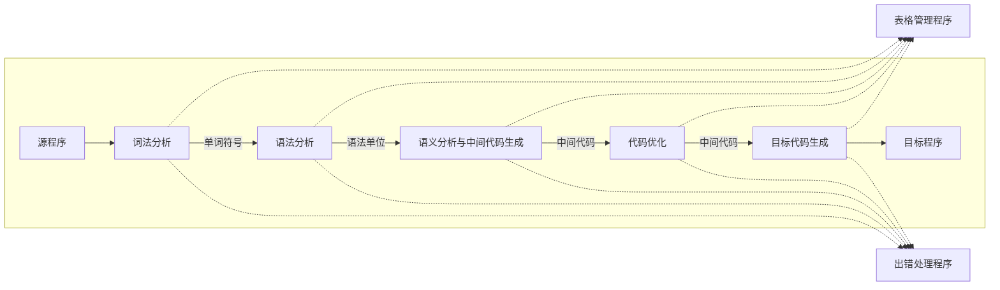

# 引论

## 编译程序

### 编译程序框架图

#### 表格管理程序
登记源程序的各类信息、和编译各阶段的进展状况.

#### 出错处理程序
编译过程中发现源程序有错误,编译程序应报告错误的性质和错误发生的地点,并且將错误所造成的影响限制在尽可能小的范围内,使得源程序的其余部分能继续编译下去,有些编译程序还能自动校正错误. 

### 遍

所谓的遍(pass)就是对源程序或源程序中间结果从头到位扫描一次,并作有关的加工处理,生成新的中间结果或目标程序.通常每遍的工作从外存中获得前一遍的中间结果(第一遍获得源程序),再把结果记录于外存.既可以将上图不同阶段合为一遍,亦可以把一阶段的工作分为若干遍.

编译程序分为几遍是很难统一的.遍数多,编译程序的逻辑结构清晰,但也会增加输入输出时间.不是每一个语言都是单遍编译程序实现.

### 编译前端与后端

我们有时把编译程序分为编译前端和编译后端.
编译前端一般为词法、语法、语义分析与中间代码生成,有的也可能包含代码优化.
后段包含与目标机有关的部分,如编译优化、目标代码生成.后段不依赖于源语言,仅依赖中间代码.如 Java 编译成 Class 文件,在不同平台的虚拟机运行.

