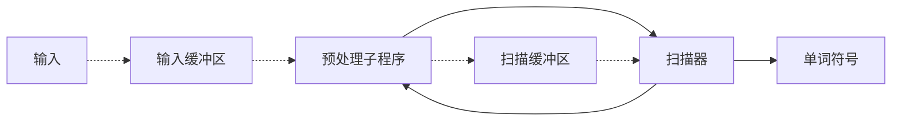
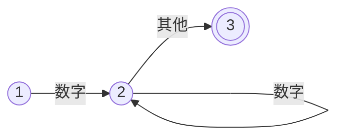
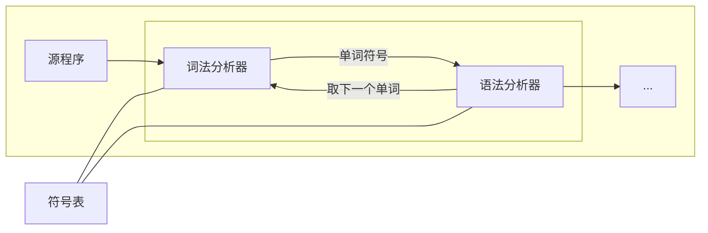

# 词法分析

词法分析的任务是: 从左至右逐个字符地对源程序进行扫描,产生一个个的单词符号,把作为字符串的源程序改造成为单词符号串的中间程序.

词法分析就需要设计词法分析器（有被广泛应用的Lex词法分析器工具），词法分析这个过程，识别字符流的时候会引出一个目前高级语言中普遍的遵循的概念： 关键字(定义符) 、标识符、常数、运算符、 分界符。

词法分析器处理识别这些关键字、标识符等等就需要引入二元式或多元式的概念，简单来说二元式就是如（type ，value）的字符表达式。

另外词法分析器识别字符流到形成标记 Token 的过程，需要用到状态转换图，确定状态的有限状态自动机（DFA），非确定状态的有限状态自动机（NFA）这些概念。

## 对词法分析器的要求

### 词法分析器输出单词的一般形式

词法分析器所输出的单词符号常常表示成如下的二元式:

$$(单词种别，单词符号的属性值)$$

#### 二元式

一般一个程序语言的单词符号可以分为五种,我们为这五种类别创建二元式:

|类别|种别码|属性值|描述|
|---|---|---|---|
|关键字|一词一种|-||
|运算符|一符一种|-|+,-,*...|
|分界符|一符一种|-|,,;,(,)...|
|常数|按类型分种|-|0,1,true,3.3,...|
|标识符|归为一种|指向符号表指针|变量名,数组名...|

对于 C 语言,词法分析例子:

```txt
 while (i>=j) i--;
输出单词符号
< while,  - >
< (,  - >
< id,  指向i的符号表项的指针 >
< >=,  - >
< id,  指向j的符号表项的指针 >
< ),  - >
< id,  指向i的符号表项的指针 >
< --,  - >
< ;,  - >
```

## 词法分析器的设计

### 结构



- 其中预处理子程序是用来:

  1. 剔除无用的空白、跳格、回车和换行等编辑性字符
  2. 区分标号区、连接续行和给出句末符等

- 扫描缓冲区

  分析器对扫描缓冲区进行扫描时一般用两个指示器,一个指向当前正在识别的单词的开始位置(指向新单词的首字符),另一个用于向前搜索以寻找单词的终点.

  这里的构建一般使用双缓冲区的形式,用于对标识符和常数长度进行限制.

  假定每半区可容 120 个字符,而这两个半区又是互补使用的.如果搜索指示器从单词起点出发搜家到半区的边缘但尚未到达单问的终点,那么预处理程序,令其把后续的 120 个输人字符装进另半区.如果两个缓冲区没有容下,则报错.

#### 超前搜索

对于一切较早对语言,程序不对关键字进行保护,需要进行超前搜索,已确定关键字还是标识符.


### 状态转换图

为了方便程序对设计,我们通常使用状态转换图来描述词法分析程序.

状态转换图是一张有限方向图:
- 结点代表状态，用圆圈表示
- 状态之间用箭弧连结，箭弧上的标记(字符)代表射出结状态下可能出现的输入字符或字符类
- 一张转换图只包含有限个状态，其中有一个为初态，至少要有一个终态,双圆圈表示终态



### 状态转换矩阵

如果我们根据状态转换图写程序,就会发现状态转换图转写成程序过程中,判断状态是机械的,那么我们就可以把这个过程写成表格,让程序自动为我们判断当前阶段的状态.我们把这个表格叫做状态转换矩阵.

我们让表格的横坐标表示输入字符(转换图中弧上的标记),纵坐标表示节点,内容是当前纵坐标节点接收到横坐标后移动到的节点.

此时输入结束的状态,就是表中的最后状态.

### 衔接语法分析器


