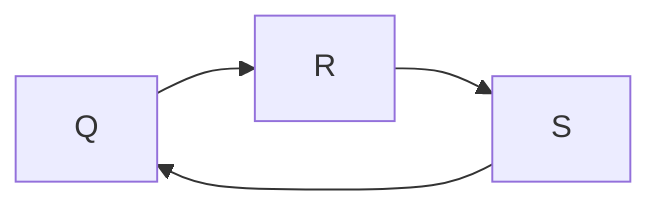

# 语法分析

我们根据语法分析树的生成顺序区分为自上而下分析和自下而上分析.

由文法开始符号出发,反复使用产生式,最终得到语法树的方式就是自上而下分析.相反的我们从输入串开始逐步规约的过程就是自下而上分析.

## 自上而下分析

### 自上而下分析的问题

- 回溯问题

  对于下面文法

  $$
  S \rightarrow xAy \\
  A \rightarrow **|*
  $$

  建立输入串 $x*y$ 的语法树.
  
  我们使用文法开始符号产生树的根结点 S,并用第一条产生式发展该树.最后得到
  
  ```mermaid
  graph TD
  A[S] --- B[x]
  A --- C[A]
  A --- D[y]
  ```
  
  使用该树和输入串进行匹配,当匹配到输入串的 * 号时,语法树对应 A 非终结符.由于 A 非终结符有两个候选,我们就要挨个匹配.
  当A 子结点是 ** 时,语法树指针运行到第二个星号后,我们就可以知道词候选匹配失败.
  
  
  
  此时我们就需要回退输入串指针到 * 号位置,去掉非终结符 A 的子结点,并考虑第二个候选. 最终匹配成功.
  
  从上面的例子就可知,从上而下分析的最大问题就是当一个非终结符用某一个候选匹配成功时,这种匹配可能是暂时的,出错时需要回溯.

- 文法左递归问题
  
  对于 $P \xRightarrow{+} Pa$,我们建立语法树时,就会发现这会让分析过程陷入无限循环.

  ```mermaid
  graph TD
  A[S] --- C[...]
  A --- B[P]
  A --- D[...]
  B --- E[...]
  B --- F[...]
  E --- G[P]
  G --- H[...]
  G --- J[...]
  ```

- 分析不成功时很难知道出错的位置

由于带有回溯的自上而下分析实际上是穷尽可能的试探法,效率很低,实际一般不采用带回溯的自上而下分析.
接下来我们会一次解决上面的问题

### 消除左递归

对于文法 $P \rightarrow P\alpha|\beta$ 我们可以对其如下改造
$$
P \rightarrow \beta P{'} \\
P{'} \rightarrow \alpha P{'}|\varepsilon
$$

一般而言,假定 P 关于的全部产生式是 $P \rightarrow P\alpha_1|P\alpha_2|...|P\alpha_m|\beta_1|\beta_2|...|\beta_n$.其中,每个 $\alpha$ 都不等于 $\varepsilon$,每个 $\beta$ 都不以 P 开头. 那么,消除 P 的直接左递归性就是把这些规则改写成:
$$
P \rightarrow \beta_1 P{'}|\beta_2 P{'}|...|\beta_n P{'} \\
P{'} \rightarrow \alpha_1 P{'}|\alpha_2 P{'}|...|\alpha_m P{'}|\varepsilon
$$

#### 包含回路

对于下面文法
$$
S \rightarrow Qc|c \\
Q \rightarrow Rb|b \\
R \rightarrow Sa|a
$$

有着循环递归



我们需要把产生式代入上一个结点的文法以减少递归的结点,直到循环只有一个结点为止.(结点是那个不重要)

最后我们得到产生式 $S \rightarrow Sabc|abc|bc|c$,在使用上面的方法消除左递归,得到:
$$
S \rightarrow abcS{'}|bcS{'}|cS{'} \\
S{'} \rightarrow abcS{'}|\varepsilon
$$

### LL(1)分析法

消除回溯应该保证:
对文法的任何非终结符,当要它去匹配输入串时,能够根据它所面临的输入符号准确地指派它的一个候选去执行任务,并且此候选的工作结果应是确信无疑的.

由此我们可以有如下定义:

令 G 是一个不含左递归的文法,对 G 的所有非终结符的每个候选 $\alpha$ 定义它的终结首符集 $FIRST(\alpha)$ 为：
$$
FIRST(\alpha) = \lbrace a|\alpha \Rightarrow a...,a \in V_T \rbrace \\
若 \alpha \xRightarrow{*} \varepsilon,\varepsilon \in FIRST(\alpha)
$$

换句话说,$FIRST(\alpha)$ 是 $\alpha$ 的所有可能推导的开头终结符或可能的 $\varepsilon$.

令 S 是文法 G 的开始符号,对于 G 的任何非终结符 A,我们定义 A 的 FOLLOW 集合:
$$
FOLLOW(A) = \lbrace a|S \xRightarrow{*} ...Aa...,a \in V_T \rbrace \\
若 S \xRightarrow{*} ...A,\# \in FOLLOW(A)
$$

#### LL(1)文法的定义:

1. 文法不带左递归
2. 对于文法中每一个非终结符 A 的各个产生式的候选首符集两两不相交.即,若 $A \rightarrow \alpha_1|\alpha_2|...|\alpha_n$,则 $FIRST(\alpha_i) \cap FIRST(\alpha_j) = \empty (i \neq j)$
3. 对文法中的每个非终结符 A,若它存在某个候选首符集包含 $\varepsilon$,则 $FIRST(\alpha_i) \cap FOLLOW(A) = \empty (i=1,2,...n)$


#### 使用
对于一个满足上述条件的文法,可以对其输入串进行有效的无回溯的自上而下分析.假设要用非终结符 A 进行匹配,面临的输入符号为 a,A 的所有产生式为

$$
A \rightarrow \alpha_1|\alpha_2|...|\alpha_n
$$

1. 若 $a \in FIRST(\alpha_i)$,则指派 $\alpha_i$ 执行匹配任务
2. 如果 a 不属于任何一个候选首符集,则

   1. 若 $\varepsilon$ 属于 $FIRST(\alpha_i)$ 且 $a \in FOLLOW(A)$,则让 A 与 $\varepsilon$ 自动匹配
   2. 否则语法错误

#### 构造 $FIRST(\varepsilon)$ 集合

$$
FOLLOW(A) = \lbrace a|S \xRightarrow{*} ...Aa...,a \in V_T \rbrace
$$

1. 如果 $\alpha = X,X \in V_T \cup V_N$ 

   **连续使用**下面的规则,直至每个集合 FIRST 不再增大为止：
   1. 若$X \in V_T$,则 $FIRST(X)＝{X}$
   2. 若$X \in V_N$,且有产生式 $X \rightarrow a…$,则把 a 加入到 $FIRST(X)$ 中；若 $X \rightarrow \varepsilon$ 也是一条产生式,则把 $\varepsilon$ 也加到 $FIRST(X)$ 中.
   3. 若 $X \rightarrow Y…$ 是一个产生式且 $Y \in V_N$,则把 $FIRST(Y)$ 中的所有非 $\varepsilon$ -元素都加到 $FIRST(X)$中；
   4. 若 $X \rightarrow Y_1 Y_2 … Y_k$ 是一个产生式,$Y_1,…,Y_{i-1}$都是非终结符
      - 对于任何 $j,1 \le j \le i-1$,$FIRST(Y_j)$ 都含有 $\varepsilon$(即$Y_1 … Y_i-1 \xRightarrow{*}\varepsilon$), 则把 $FIRST(Y_i)$ 中的所有非 $\varepsilon$-元素都加到 $FIRST(X)$ 中
      - 若所有的$FIRST(Y_j)$均含有 $\varepsilon,j＝1,2,…,k$,则把 $\varepsilon$ 加到 $FIRST(X)$ 中

2. 如果 $\alpha = X_1X_2...X_n,X_i \in V_T \cup V_N$ 

   1. 置 $FIRST(α) ＝FIRST(X_1) / \{\varepsilon\}$
   2. 若对任何 $1≤j≤i-1,\varepsilon∈FIRST(X_j)$,则把 $FIRST(X_i)/\{ε\}$ 加至 $FIRST(\varepsilon)$ 中；特别是,若所有的 $FIRST(X_j)$ 均含有 $\varepsilon,1≤j≤n$ ,则把 $\varepsilon$ 也加至 $FIRST(\varepsilon)$ 中.显然,若 $\alpha＝\varepsilon$ 则 $FIRST(\alpha)＝{\varepsilon}$.

#### 构造 $FOLLOW(A)$ 集合
$$
FOLLOW(A) = \lbrace a|S \xRightarrow{*} ...Aa...,a \in V_T \rbrace
$$

**连续使用**下面的规则,直至每个 FOLLOW 不再增大为止

1. 对于文法的开始符号 S,置 $＃$ 于 $FOLLOW(S)$ 中；
2. 若 $A \rightarrow \alpha B \beta$ 是一个产生式,则把 $FIRST(\beta)/\{\varepsilon\}$ 加至 $FOLLOW(B)$ 中
3. 若 $A \rightarrow \alpha B$ 是一个产生式,或 $A \rightarrow \alpha B \beta$ 是一个产生式而 $β \xRightarrow{X}\varepsilon$ (即$\varepsilon \in FIRST(β)$),
   则把 $FOLLOW(A)$ 加至 $FOLLOW(B)$ 中.

### 递归下降分析程序

每个非终结符有对应的子程序的定义,首先在分析过程中,当需要从某个非终结符出发进行展开(推导)时,就调用这个非终结符对应的子程序.

对于文法 $A \rightarrow TE{'} | BC | \varepsilon$ 它的递归下降程序:
```
PROCEDURE  A；
BEGIN
    IF  SYM in FIRST(TE’) THEN
		BEGIN  T；E′ END
    ELSE IF  SYM in FIRST(BC) THEN
		BEGIN  B; C  END
    ELSE IF  SYM in FOLLOW(A) THEN
		BEGIN  END
	ELSE ERROR
END；
```

其中 SYM 指 IP 当前所指的输入符号

### 预测分析程序


#### 分析表的构造

1. 构造 $FIRST(\varepsilon)$ 和 $FOLLOW(A)$
2. 构造分析表 $M[A,a]$
   1. 对文法 G 的每个产生式 $A \rightarrow α$ 执行第2步和第3步
   2. 对每个终结符 $a \in FIRST(\alpha)$,把 $A \rightarrow α$ 加至 $M[A,a]$ 中
   3. 若 $\varepsilon \in FIRST(\alpha)$,则对任何 $b \in  FOLLOW(A)$ 把 $A \rightarrow α$加至 $M[A,b]$ 中
   4. 把所有无定义的 $M[A,a]$ 标上出错标志

如 对于文法
$$
E \rightarrow TE{'} \\
E{'} \rightarrow +TE{'}|\varepsilon \\
T \rightarrow FT{'} \\
T{'} \rightarrow *FT{'}|\varepsilon \\
F \rightarrow (E) |i
$$

它的 FIRST 和 FOLLOW 集合

$$
FIRST(E) = \{(,i\} \quad FOLLOW(E) = \{),\#\} \\
FIRST(E′)= \{+, \varepsilon\} \quad FOLLOW(E′)= \{),\#\} \\
FIRST(T) = \{(,i\} \qquad FOLLOW(T) = \{+,),\#\} \\
FIRST(T′)= \{*, \varepsilon\} \qquad FOLLOW(T′)= \{+,),\#\} \\
FIRST(F) = \{(,i\} \qquad FOLLOW(F) = \{*,+,),\#\} 
$$


由此我们可以得到预测分析程序


```
BEGIN
   首先把‘＃’然后把文法开始符号推进STACK栈；
   把第一个输入符号读进a；
   FLAG:=TRUE;
   WHILE  FLAG  DO
   BEGIN
       把STACK栈顶符号上托出去并放在X中；
       IF X∈VT THEN
	        IF X= a  THEN 把下一输入符号读进a
	                       ELSE   ERROR
       ELSE IF X=‘#’ THEN
	         IF X=a THEN FLAG:=FALSE 
                         ELSE ERROR
       ELSE IF M[X,a]={X→X1X2…Xk}THEN
         	把Xk,Xk-1,…,X1一一推进STACK栈
	        /* 若X1X2…Xk=ε,不推什么进栈 */
       ELSE ERROR
    END OF WHILE;
STOP /*分析成功,过程完毕*/
END
```

#### 二义性

如果 G 是左递归或二义的,那么,M 至少含有一个多重定义入口.
