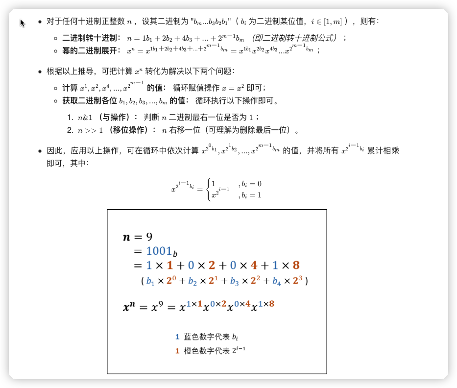

# 书中例题和练习题的一点看法
## 最大子序列

题目见书 4.2.3
前两种算法是简单的循环求解.第三种算法使用了递归方法,其递归方程为
$$
    f(x)= max(f(x_i),f(x_j),max(\sum_{k=\frac {x}{2}}^{i}x_k) + max(\sum_{h=j}^xx_h)),
    0<=i<=\frac {x}{2},\frac {x}{2} <j <= x             
$$
算法四 我们仔细分析看看为何如此之快
我们通读代码,在根据题意可以得到
本程序使用一次循环,是建立在记录了前面数据最大值,即一个简单的动态规划

如果有一个数组 $A_i$,有以下条件
1. 如果 $f(x) < 0$,则令 $f(x) = 0$  
2. $f(x) = max(f(x-1) + A_i,A_i)$

同理如果最大子序列可以是负数,即如果对于序列$A$ 是 [-2,-1] 最小子序列是 [-1].我们可以类推以下条件:
1. 如果 $f(x) < A_i$,则令 $f(x) = A_i$  
2. $f(x) = max(f(x-1) + A_i,A_i)$

> 见[leetcode 最大子序列](https://leetcode.cn/problems/maximum-subarray/submissions/)

## $\sqrt n$的时间时间复杂度

类比 $\Omicron (N)$ 是如下代码的时间复杂度
```c
for(int i=0;i<N;i++)
```
$\sqrt n$的时间时间复杂度就是 N 变为 $\sqrt n$.

## 快速幂
对于书中快速幂是在讲 $\Omicron logN$ 时提到的.但书中的例子 求 $X^N$ 只能运行在 N 大于 0 的情况.
N 如果要取到负数,需要在调用 Pow 函数前对 N 进行判断正负.如果为负,直接计算 $\frac {1}{Pow(X,N)}$.  
注意,不能在 Pow 函数中求负数次方,否则结果不精确.

习题 2.16 要求不使用递归,求解幂.这需要一个简便方法


