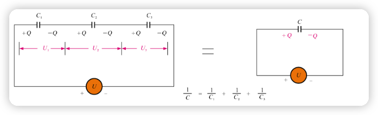
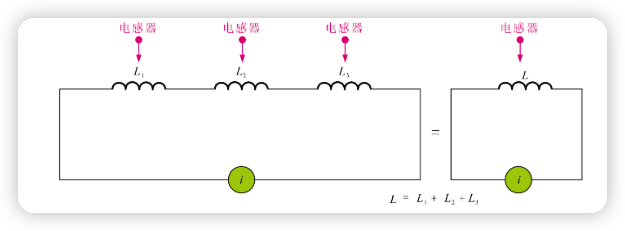
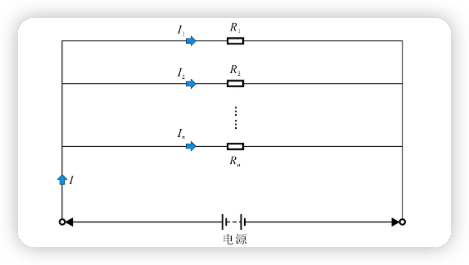
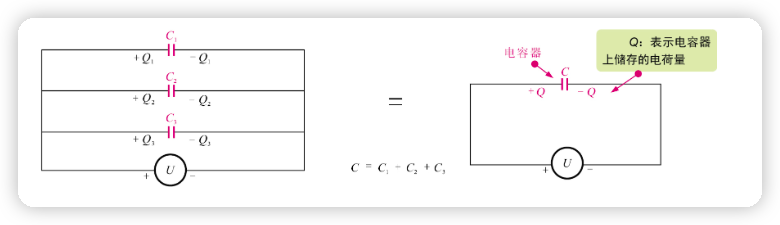
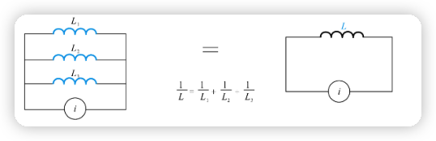

# 基本知识

## 常用定义

### 电流
电流定义
$$
    I \rarr \frac {Q}{t}
$$
其中 Q 是电量的变化 $\vartriangle {Q}$.电流的正负相对于参考方向而言的.参考方向由人为规定.  

### 电位
电位的定义电位即电势，是衡量电荷在电路中某点所具有能量的物理量.规定电路中有电量为 q 的电荷,具有 $W_A$ 的能量,则此点电位为
$$
  U_A = \frac {W_A}{q}
$$
确定电路中某点电位时,需要给定参考点.零电位参考点电位为零.注意不能定义两个零电位参考点,否则视为短接.有了参考点的定义之后，电位的数值便可正可负.

### 电压
欧姆定律:
$$
  U = IR \\
  U_AB = \frac {W_{AB}}{q} =  \frac {W_A - W_B}{q} = U_A - U_B
$$
与电流相同,电压也有正负.电压的正负也是相对于参考方向而言的.一般书中的电流、电压方向都是参考方向.

> **对于一个二端元件,如果电流、电压方向相同,我们称该元件的电压、电流的参考方向是关联的,否则是非关联的.**

### 电功率
电工率和焦耳定律:
$$
  W = UIt \\
  P = UI = \frac {W}{t} = I^2R = \frac {U^2}{R} \\
  Q= I^2Rt
$$
其中 Q 热量 使用 $I^2Rt$ 而不是 $UIt$ 是因为后者比前者大,代表电路中的做功综合即机械能加热能.

> 为什么传送电能使用高压电?  
> 由于总功率 P 是不变的,当使用高压电 根据公式 ${P = UI}$ 电流就会减小,传送的电线只能发热 根据公式 ${Q=I^2Rt}$ 电流减小就会显著减小发热损耗.  
 
**因为电压、电流是具有方向的.所以电功率有正负.对于关联参考方向, P > 0 说明消耗能量,反之产生能量;而对于非关联参考方向, P > 0 产生能量, P < 0 消耗能量.**
> 注意关联和非关联的是参考方向而不是真实方向.

### 基尔霍夫定律
#### 基尔霍夫电流定律(KCL)
  定义: 在任意时刻,流入结点或闭合电路的代数和为零.
#### 基尔霍夫电压定律(KVL)
  定义:在任意时刻,沿着任意回路的绕行方向上,所有的之路或元件电压代数和为零.
## 电路
电路有能量的传递、分配、转换、储存,信号的传递、变换、处理、控制等作用.  
电路分为串联和并联,根据元器件分为电阻器、电容器、电感器.

### 串联电路
在串联电路中电流各处相等.电压根据电阻值分压.

1. 电阻器串联

    $U = I(R_1 + R_2 + ... + R_n)$

    

2. 电容器串联
    
    电容器所存电荷量与电容器的容量和电容器所加电压成正比.  
    如果电容器上的电荷量都为同一个值 Q ,有以下公式
    $$
      U_1 = \frac {Q}{C_1},U_2 = \frac {Q}{C_2},U_3 = \frac {Q}{C_3}
    $$
    将串联电容是为同一电容,则
    $$
      \frac {Q}{C} = \frac {Q}{C_1} + \frac {Q}{C_2} +\frac {Q}{C_3}
      \rarr \frac {1}{C} = \frac {1}{C_1} + \frac {1}{C_2} +\frac {1}{C_3} 
    $$
    

3. 电感器串联

    电感量和线圈匝数成正比.总电感量和计算总电阻的方法相同
    $$
      L = L_1 + L_2 + L_3
    $$
    

### 并联电路
在并联电路中电压各处相同.

1. 电阻器并联

    因为电压相同,所以有
    $$
      I = U(\frac {1}{R_1}+ \frac {1}{R_2} + ... + \frac {1}{R_n})
      \rarr \frac {1}{R} = \frac {1}{R_1}+ \frac {1}{R_2} + ... + \frac {1}{R_n}
    $$
    
    > $\frac {1}{R}$ 称为电导值,形容电阻器导电能力

2. 电容器并联

    首先我们使用 Q 表示电荷量 C 为电容器,则
    $$Q = CU$$
    由于电压相同,如果把各个电容视为一个则有
    $$C = C_1 + C_2 + C_3$$             
    并联电容的合成电容等于三个电容之和.
    
3. 电感器并联

    电感和电阻很像并联电感“倒数等于三个电感的倒数之和，即
    $$\frac {1}{L} = \frac {1}{L_1} + \frac {1}{L_2} + \frac {1}{L_3}$$
    

### 混联电路
分析混联电路有两种方法:
1. 利用电流的流向及电流的分合将电路分解成局部串联和并联的方法
2. 利用电路中等电位点分析混联电路

