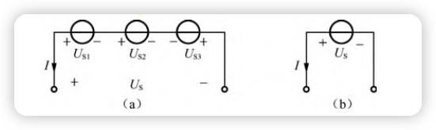
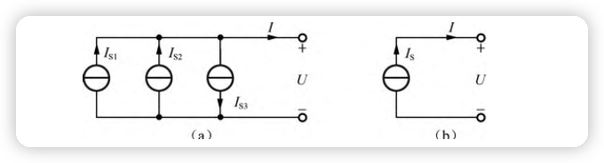
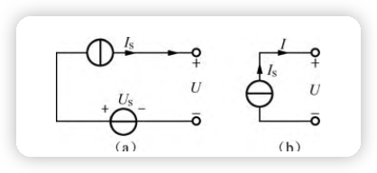
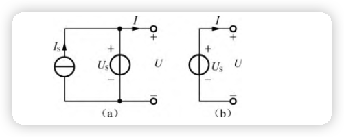
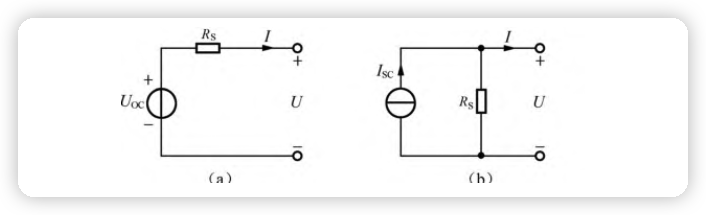

# 基本知识

## 常用定义

### 电流
电流定义
$$
    I \rarr \frac {dq}{dt}\rarr \frac {Q}{t}
$$
其中 Q 是电量的变化 $\vartriangle {Q}$.电流的正负相对于参考方向而言的.参考方向由人为规定.  

### 电位
电位的定义电位即电势，是衡量电荷在电路中某点所具有能量的物理量.规定电路中有电量为 q 的电荷,具有 $W_A$ 的能量,则此点电位为
$$
  U_A \rarr \frac {W_A}{q}
$$
确定电路中某点电位时,需要给定参考点.零电位参考点电位为零.注意不能定义两个零电位参考点,否则视为短接.有了参考点的定义之后，电位的数值便可正可负.

### 电压
欧姆定律:
$$
  U = IR \\
  U_AB \rarr \frac {dw}{dq} \rarr \frac {W_{AB}}{q} =  \frac {W_A - W_B}{q} = U_A - U_B
$$
与电流相同,电压也有正负.电压的正负也是相对于参考方向而言的.一般书中的电压的极性和电流方向都是参考方向.

> **对于一个二端元件,如果电压的极性和电流方向相同,我们称该元件的电压的极性和电流方向是关联的,否则是非关联的.**

### 电阻
电阻即阻碍电流的能力.用横截面为 A 的材料的的电阻取决于截面面积 A 以及长度 l,公式为
$$
  R = \rho \frac {l}{A}
$$
其中 $\rho$ 称为电阻率,单位为 $\Omega*m$.

注意: 只有线性电阻遵守欧姆定律.非线性电阻不遵循,其阻值随流过它的电流变化而变化.虽然实际电阻在某些条件下都是非线性的,但为了方便都视为线性电阻.
> 另一个有用的量是电阻的倒数:  
> $\frac {1}{R}$ 称为电导值,形容电阻器导电能力.单位是西门子或姆欧(S).

### 电功率
电工率和焦耳定律:
$$
  W = UIt \\
  P = UI = \frac {W}{t} = I^2R = \frac {U^2}{R} \\
  Q= I^2Rt
$$
其中 Q 热量 使用 $I^2Rt$ 而不是 $UIt$ 是因为后者比前者大,代表电路中的做功综合即机械能加热能.

> 为什么传送电能使用高压电?  
> 由于总功率 P 是不变的,当使用高压电 根据公式 ${P = UI}$ 电流就会减小,传送的电线只能发热 根据公式 ${Q=I^2Rt}$ 电流减小就会显著减小发热损耗.  
 
**因为电压、电流是具有方向的.所以电功率有正负.对于关联参考方向, $P = +ui;P > 0$ 说明消耗能量,反之产生能量;而对于非关联参考方向,$P = -ui;P > 0$ 产生能量, $P < 0$ 消耗能量.**
> 注意关联和非关联的是参考方向而不是真实方向.

### 节点支路回路
支路是网络中的单个元件.  
节点是两条或多条支路的连接点.  
回路是电路中的任意闭合路径.

### 基尔霍夫定律
#### 基尔霍夫电流定律(KCL)
  定义: 在任意时刻,流入结点或闭合电路的代数和为零.它是基于电荷守恒定律的.  
  换句话说, KCL 即流入节点或闭合电路电流之和等于流出节点或闭合电路电流电流之和.

#### 基尔霍夫电压定律(KVL)
  定义:在任意时刻,沿着任意回路的绕行方向,即闭合回路上,所有的之路或元件电压代数和为零.
  也可以解释为:电压降之和等于电压升之和.

## 电路
电路有能量的传递、分配、转换、储存,信号的传递、变换、处理、控制等作用.  
电路分为串联和并联,根据元器件分为电阻器、电容器、电感器.

### 串联电路
在串联电路中电流各处相等.电压根据电阻值分压.

1. 电阻器串联

    $U = I(R_1 + R_2 + ... + R_n)$  
    两个电阻串联等效电阻:
    $R = R_1 + R_2$  
    两个电阻串联等效电导:
    $G = \frac {G_1G_2}{G_1 + G_2}$

    

    各个电阻分压公式为
    $$
      U_n = \frac {R_n} {R_1 + R_2 + ... + R_n}U
    $$

2. 电容器串联
    
    电容器所存电荷量与电容器的容量和电容器所加电压成正比.  
    如果电容器上的电荷量都为同一个值 Q ,有以下公式
    $$
      U_1 = \frac {Q}{C_1},U_2 = \frac {Q}{C_2},U_3 = \frac {Q}{C_3}
    $$
    将串联电容是为同一电容,则
    $$
      \frac {Q}{C} = \frac {Q}{C_1} + \frac {Q}{C_2} +\frac {Q}{C_3}
      \rarr \frac {1}{C} = \frac {1}{C_1} + \frac {1}{C_2} +\frac {1}{C_3} 
    $$
    

3. 电感器串联

    电感量和线圈匝数成正比.总电感量和计算总电阻的方法相同
    $$
      L = L_1 + L_2 + L_3
    $$
    

### 并联电路
在并联电路中电压各处相同.

1. 电阻器并联

    因为电压相同,所以有
    $$
      I = U(\frac {1}{R_1}+ \frac {1}{R_2} + ... + \frac {1}{R_n})
      \rarr \frac {1}{R} = \frac {1}{R_1}+ \frac {1}{R_2} + ... + \frac {1}{R_n}
    $$
    两个电阻并联等效电阻:
    $R = \frac {R_1R_2}{R_1 + R_2}$  
    两个电阻并联等效电导:
    $G = G_1 + G_2$  

    

    各个电阻并联分流公式, G 是 各个电阻的电导
    $$
      I_n = \frac {G_n} {G_1 + G_2 + ... + G_n}I
    $$

2. 电容器并联

    首先我们使用 Q 表示电荷量 C 为电容器,则
    $$Q = CU$$
    由于电压相同,如果把各个电容视为一个则有
    $$C = C_1 + C_2 + C_3$$             
    并联电容的合成电容等于三个电容之和.
    
3. 电感器并联

    电感和电阻很像并联电感“倒数等于三个电感的倒数之和，即
    $$\frac {1}{L} = \frac {1}{L_1} + \frac {1}{L_2} + \frac {1}{L_3}$$
    

### 混联电路
分析混联电路有两种方法:
1. 利用电流的流向及电流的分合将电路分解成局部串联和并联的方法
2. 利用电路中等电位点分析混联电路

## 等效电路

### $\vartriangle$ 型与 Y 型等效电路

$\vartriangle$ 转换为 Y 型等效电路:
$R_i = \frac {\vartriangle 中相邻电阻的乘积} {\vartriangle 电阻之和}$

Y 型转换为 $\vartriangle$:
$R_i = \frac {Y中各个电阻两两相乘之和}{Y 中另一端电阻}$

### 独立电源间的串联和并联等效
#### 理想电压源的串联
将多个电压源串联起来构成一个二端网络,如图所示

$$U = U_{s1} + U_{s2} - U_{s3}$$

#### 理想电流源的并联
将多个电流源并联起来构成一个二端网络,如图所示

$$I = I_{s1} + I _{s2} - I_{s3}$$

#### 电压源与电流源的串联并联
##### 串联
如图所示为一个电压为U S的电压源串联电流为I S的电流源， 显然该电路的伏安特性表达式为
$$I = I_s$$

其等效电路是一个电流为I S的电流源.
##### 并联
如图为一个电压为U S的电压源并联电流为I S的电流源

其等效电路是一个电压为U S的电压源.
#### 注意
1. 除了电压源电压相同外,理想电压源不能并联.
2. 除了电流源电流相同外,理想电流源不能串联.

### 电源模型及其等效变换
此两者互为等效电路

模型满足
$$U_{OC} = R_sI_{SC}$$

